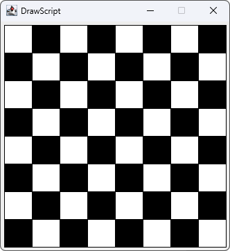
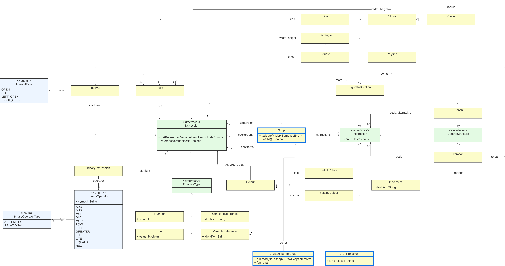

<p align="center"></p>

## What is this?
**Drawscript** is a simple scripting library that allows for the generation of basic geometric drawings
using Java's Swing library.

This scripting language was developed as the final project for a [Programming Language Engineering](https://fenix.iscte-iul.pt/disciplinas/elp/2022-2023/2-semestre/pagina-inicial)
course as part of elective coursework for the [Bachelor's in Computer Engineering](https://www.iscte-iul.pt/curso/3/licenciatura-engenharia-informatica) at 
[Iscte-IUL](https://www.iscte-iul.pt/).

## Features
- [x] **Manual creation of Abstract Syntax Tree**
- [ ] **Semantic Validation**
  - [x] Window dimension must be a (x,y) point
  - [x] Window background colour must be an (r,g,b) colour
  - [x] Conditional branches must use Boolean-expression guards
  - [x] Constant references must reference previously-defined constant
  - [x] Colour RGB values must be numeric and in \[0..255]
  - [x] Point x,y coordinates must be numeric
  - [x] Interval bounds must be numeric
    - [x] Bounds must be in ascending order
  - [x] Binary expressions follow operand-operator context-sensitive restrictions (e.g. can only add together numbers, cannot add a number to an interval, etc.)
  - [x] Set-colour instructions must take values of type Colour
  - [ ] Variables can only be referenced in the scope of their definition (inside declaring loop)
- [x] **Parsing**
- [x] **Interpretation**
  - [x] Visualisation window instantiated correctly
  - [x] Figures drawn correctly

## Examples
### Generating a simple grid pattern
<p align="center"></p>

```
N: 8
SIDE: 40
MARGIN: 5
BLACK: |0|
WHITE: |255|
GRAY: |128|
---
dimension: (N * SIDE + MARGIN * 2,N * SIDE + MARGIN * 2)
background: GRAY
---
setlinecolor BLACK
for l in [0, N[ {
  for c in [0, N[ {
    if ((l + c) % 2 == 0) {
      setfillcolor WHITE
    } else {
      setfillcolor BLACK
    }
    square (c * SIDE + MARGIN,l * SIDE + MARGIN), SIDE
  }
}
setlinecolor |0|0|255|
square (MARGIN,MARGIN), N * SIDE
```

## Class Diagram
As per the original project specifications, the figure below presents the class structure of the project.


## Credit
Full credit for the basic specification of the library's requirements goes to Professor
[André L. Santos](https://andre-santos-pt.github.io/), Assistant Professor at Iscte-IUL and coordinator of the course
this library was developed for. The original project specification can be found 
[here](https://docs.google.com/document/d/1Mq4h8Qpt2mXEpzDeE_hkuN5z8W_jS7jiWlUc2JjTUak/edit#heading=h.ribe56dmk07m).

Credit for all the code present in this repository goes to
[Afonso Caniço](https://ciencia.iscte-iul.pt/authors/afonso-canico/cv) and 
[João Pereira](https://www.linkedin.com/in/jo%C3%A3o-vilares-pereira-180223227/), authors and sole contributors to the 
project and this repository, unless otherwise explicitly stated.